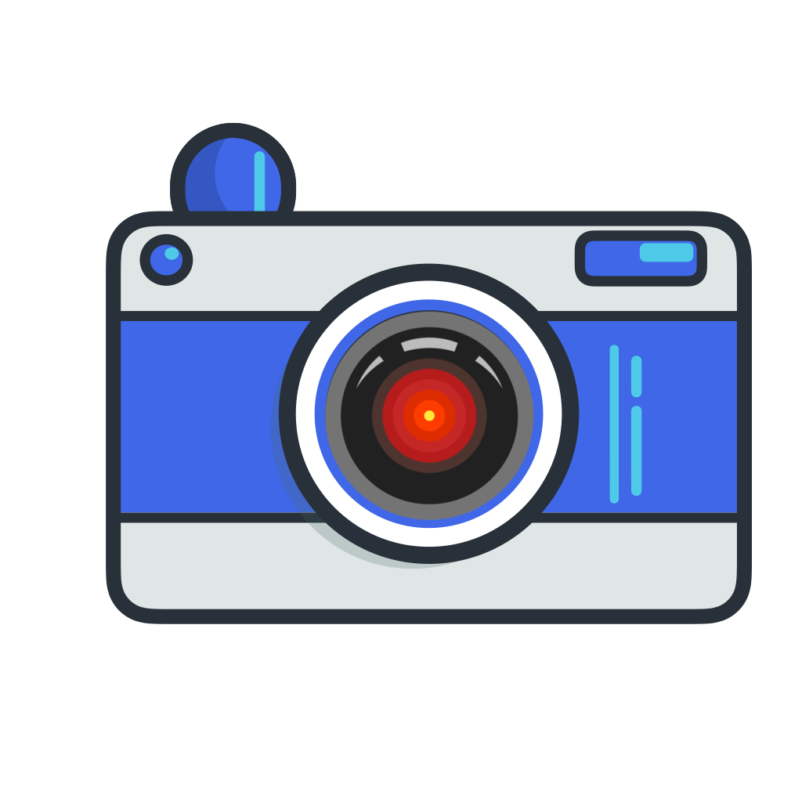
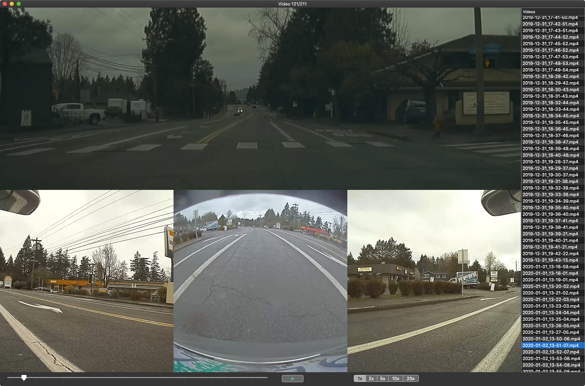

# TeslaCamViewer

## Usage

- Open the project in Xcode 14.2 or later
- Build and Run
- Currently tested against macOS 13.3 or later

## Keyboard Shortcuts

The app is heavily keyboard shortcut driven. Here's a list of shortcuts:

- `o` - Show the open folder panel
- `a` - Show / Hide video list
- `{space}` - Play / Pause
- `j` - Next video
- `k` - Previous video
- `h` - Decrease playback speed
- `l` - Increase playback speed
- `r` - Restart video
- `t` - Change video gravity
- `s` - Show / Hide progress slider
- `d` - Show / Hide debug panel

## Notes

- This project is currently just used by me for quickly reviewing Sentry + Dashcam footage.

## License

Apache 2.0. See LICENSE file.
